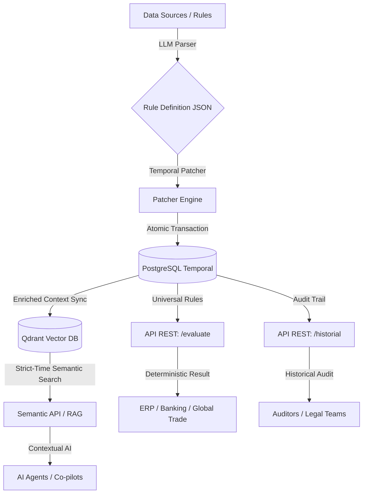

# 📂 Project Bitacora: Tempus Rule Engine

**Cut-off Date:** Feb 26, 2026
**Status:** Successfully pivoted to a Domain-Agnostic, Universal Temporal Rule Engine.
**Repository:** `JPatronC92/Lex-API-Mx`

---

## 1️⃣ What is Tempus?

Tempus is **Universal Compliance Infrastructure**. It treats rules (legal, financial, logistic, medical) as versioned source code. 

By leveraging PostgreSQL's advanced temporal ranges and Qdrant's vector capabilities, Tempus allows for deterministic "Time Travel" evaluation. This means you can ask the engine: *"Was this transaction valid according to the rules active on June 15th, 2024?"* and get a mathematically certain answer, free from AI hallucinations.

---

## 2️⃣ Technical Inventory

### A. Data Architecture (Temporal Heart) 🫀

* **Temporal Engine:** PostgreSQL 16 with `DATERANGE` and `ExcludeConstraint`.
* **Integrity:** Guaranteed non-overlapping validity ranges via `GiST` indexes at the database level.
* **Models:** Clean separation between Immutable Identity (`ReglaIdentidad`) and Versioned Logic (`ReglaVersion`).

### B. Core API Endpoints 🌐

| Endpoint | Status | Description |
| --- | --- | --- |
| `POST /api/v1/compliance/evaluate` | ✅ Operational | **Universal Engine**. Evaluates a generic transaction context against all active rules for a specific `fecha_operacion`. Includes **JSON Schema validation** for inputs. |
| `GET /api/v1/history/articulos/{uuid}/historial` | ✅ Operational | Audit trail. Returns the full lifecycle (past, present, future) of any versioned entity. |

### C. System Components 🏗️

| Component | Path | Function |
| --- | --- | --- |
| **Compliance Engine** | `src/domain/services/compliance_engine.py` | Deterministic evaluator using `json-logic` and pre-execution schema validation. |
| **Vector Store (Qdrant)** | `src/infrastructure/vector_store.py` | **Semantic Wing**. Stores embeddings of rules filtered strictly by their temporal metadata. |
| **CI/CD Pipeline** | `.github/workflows/main.yml` | Automated testing with Postgres and Qdrant services in the cloud. |

---

## 3️⃣ System Architecture (Phase 2)

---

## 4️⃣ Roadmap

1. **Rust Engine Migration:** Rewrite the core evaluator in Rust for ultra-high performance (100k+ transactions per second).
2. **Backoffice UI:** A dashboard to manage rules, visualize temporal ranges, and approve new rule versions proposed by AI.
3. **Multi-Tenant Support:** Allowing different organizations to host their own isolated rule sets on the same infrastructure.
