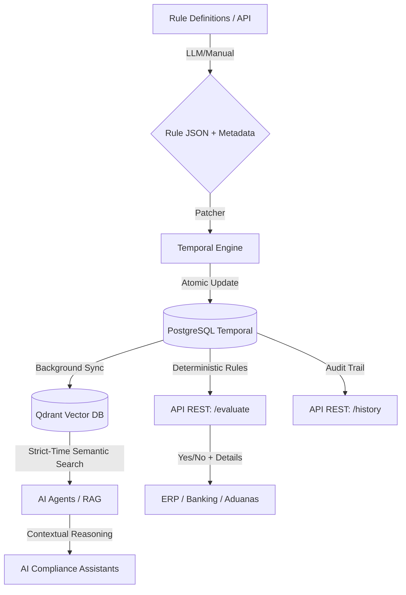

# Tempus Rule Engine ⏳⚛️

**The Universal, Deterministic & Time-Travel Compliance Infrastructure.**

[](https://github.com/JPatronC92/Lex-API-Mx/actions/workflows/main.yml)
[](https://www.python.org/downloads/)
[](https://fastapi.tiangolo.com/)
[](https://opensource.org/licenses/MIT)

Tempus is a high-performance, domain-agnostic rule engine designed for mission-critical compliance. It treats business logic, legal requirements, and technical constraints as **versioned source code**, allowing you to evaluate transactions against the exact rules that were active at any specific point in history—or even future rules already approved.

---

## 🚀 Why Tempus?

In complex industries (Fintech, Global Trade, Health), rules change constantly. Most systems only know the "current" state of a rule. **Tempus knows the entire timeline.**

### 🌟 Core Superpowers

*   **🕰️ Absolute Time-Travel:** Leveraging PostgreSQL's `DATERANGE` and `ExcludeConstraint` (GiST), Tempus mathematically guarantees that rule versions never overlap. You can audit a 2022 transaction against 2022 rules with 100% certainty.
*   **🧠 Zero-Hallucination Determinism:** Uses `json-logic` for rule execution. Given the same input and date, the output is identical forever. No probabilistic AI "guesses" for compliance.
*   **🛡️ Built-in Input Guard:** Every rule can have an optional **JSON Schema** to validate incoming transaction data *before* execution, ensuring data integrity.
*   **🔍 Strict-Time Semantic Search:** Integrated with **Qdrant Vector DB**. Search rules conceptually (e.g., *"Show me import restrictions for microchips"*) while automatically filtering out any rule that wasn't legally active on the target date.

---

## 🏗️ Architecture

Tempus follows a **Clean Architecture** pattern, splitting concerns between two massive operational wings:



---

## 🛠️ Tech Stack

*   **Runtime:** Python 3.12+ with `uv` for lightning-fast dependency management.
*   **Web Framework:** FastAPI (Asynchronous).
*   **Primary DB:** PostgreSQL 16 (Temporal ranges & GiST indexes).
*   **Vector DB:** Qdrant (Semantic indexing).
*   **Rule Logic:** `json-logic-qubit`.
*   **LLM Integration:** LiteLLM (Agnostic: OpenAI, Anthropic, DeepSeek).

---

## ⚡ Quick Start

### 1. Prerequisites
* [Docker & Docker Compose](https://docs.docker.com/compose/)
* [uv](https://github.com/astral-sh/uv) (Recommended)

### 2. Infrastructure Setup
```bash
# Clone and enter
git clone https://github.com/JPatronC92/Lex-API-Mx.git && cd Lex-API-Mx

# Start DB and Qdrant
docker-compose up -d

# Install dependencies
uv sync
```

### 3. Initialize & Seed
```bash
# Run migrations to setup temporal constraints
uv run alembic upgrade head

# Seed a sample Universal Rule (e.g., Aduana MEX Microchips)
uv run python scripts/seed_universal_rules.py
```

### 4. Run the API
```bash
uv run uvicorn src.interfaces.api.main:app --reload
```

---

## 🔌 API Showcase: `/evaluate`

Evaluate a transaction against the matrix of rules active at a specific point in time.

**POST** `/api/v1/compliance/evaluate`

```json
{
  "transaccion": {
    "codigo_hs": "8542.31",
    "origen": "TWN",
    "valor_usd": 50000,
    "tiene_certificado_nom": false
  },
  "fecha_operacion": "2026-03-15"
}
```

**Response (BLOCKER):**
```json
{
  "es_valido": false,
  "score_cumplimiento": 0.0,
  "errores": [
    "The shipment from TWN requires Certificate NOM-019 because its value ($50,000) exceeds $1,000 USD."
  ],
  "detalles_fallos": [
    {
      "clave": "ADUANA-MEX-8542-NOM",
      "severidad": "BLOCKER",
      "mensaje": "The shipment from TWN requires Certificate NOM-019..."
    }
  ]
}
```

---

## 🗺️ Roadmap

*   [ ] **Rust Core:** Rewrite the evaluation loop in Rust for sub-millisecond latency at scale.
*   [ ] **Backoffice UI:** Visual timeline for rule management and approval workflows.
*   [ ] **Multi-Tenancy:** Isolated rule-spaces for different organizational departments.

---

## 📄 License
MIT License. Created by [JPatronC92](https://github.com/JPatronC92).
